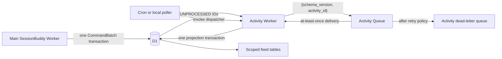

# Activity pipeline design and operations

Status: implemented locally; development rollout requires a fresh D1 database  
Scope: successful API activity capture, asynchronous distribution, and scoped feeds  
Primary code: `src/sessionbuddy/platform/db/commands.py`,
`src/sessionbuddy/platform/activity.py`, `src/activity_entry.py`, and
`wrangler.activity.jsonc`

## 1. Purpose

The activity pipeline records successful CRUD activity once, then distributes
references to that activity into the feeds that should contain it. It keeps the
request path responsible only for committing domain state and the durable raw
activity. A separate Worker performs projection work.

The pipeline is not the legacy security-audit stream. `audit_events` remains the
security and compliance record with detailed action names and protected
metadata. User-facing activity widgets read `activities` through scoped
projection tables such as `organization_activity`; they do not read
`audit_events`.

The design has four goals:

1. Record only successful API mutations.
2. Commit the domain mutation, raw activity, routing facts, and initial status
   atomically.
3. Project one activity into every applicable feed in one later transaction.
4. Remain safe under duplicate queue delivery, worker interruption, stale
   claims, and retries.

## 2. Runtime topology



There are two deployed Python Workers:

- The main Worker serves SessionBuddy and writes domain state plus raw
  activities.
- `sessionbuddy-activity-development` runs a cron dispatcher and consumes the
  activity queue.

Both Workers bind the same environment-specific D1 database. The activity
Worker also has producer and consumer bindings for the environment-specific
activity queue.

Locally, Docker Compose starts:

- `worker` on port `8787`;
- `activity-worker` on port `8788`;
- `activity-poller`, which invokes the local-only dispatch endpoint once per
  second.

The local polling endpoint is available only when `APP_ENV=local`. Deployed
development uses the cron handler instead.

## 3. Canonical activity record

`activities` intentionally stores a small CRUD statement:

| Column | Meaning |
| --- | --- |
| `id` | Public activity ID such as `A123`. |
| `actor_type` | `user`, `system`, or `anonymous`. |
| `actor_id` | Optional public actor ID such as `U789`. |
| `operation` | `create`, `read`, `update`, or `delete`. |
| `resource_type` | Stable resource vocabulary such as `event`, `proposal`, or `invitation`. |
| `resource_id` | Public resource ID such as `P456`. |
| `occurred_at_ms` | Time the successful operation committed. |

The raw record does not contain email addresses, names, proposal text, form
answers, tokens, private URLs, or arbitrary request metadata.

`activity_entities` maps public IDs to internal IDs. It allows activity records
to remain safe and stable while authorized read APIs resolve a display name
from the current tenant-scoped domain table. A feed API must never return the
internal ID or use the mapping to bypass organization or event predicates.

`activity_routing` stores operational routing facts:

- `organization_id`, when the activity belongs to an organization;
- `event_id`, when it belongs to an exact event.

Routing facts are not activity semantics. They tell the distributor which feed
classes apply.

## 4. Request transaction

Every successful audited mutation uses `CommandBatch`. The handler adds its
domain statements and then adds one `ActivityRecord`. `CommandBatch.activity()`
adds the following statements to the same D1 batch:

1. Ensure the public actor mapping exists, if there is a user actor.
2. Ensure the public resource mapping exists.
3. Insert the row in `activities`.
4. Insert `activity_status` with `status='UNPROCESSED'`.
5. Insert `activity_routing` with the organization and optional event.

If any statement fails, the domain mutation and activity write both roll back.
Failed API calls do not produce activity records. The request does not publish
directly to the queue, so a queue outage cannot make a successful domain write
disappear or make the HTTP response wait on Cloudflare Queues.

## 5. Dispatch

`dispatch_pending_activities()` selects at most 100 rows whose status is
`UNPROCESSED` and whose queue marker is absent or older than 60 seconds. It
publishes only this bounded envelope:

```json
{"schema_version": 1, "activity_id": "A123"}
```

After a successful queue publish, the dispatcher writes `queued_at_ms`. A
publish failure leaves the activity `UNPROCESSED`, stores only a safe exception
class in `last_error_code`, and allows a later cron invocation to retry it.

The queue marker is deliberately a resend throttle, not proof of delivery.
After 60 seconds an unprocessed activity can be published again. Projection is
idempotent, so duplicate messages are safe.

## 6. Distribution and processors

The queue consumer validates the exact versioned envelope and then attempts to
claim the activity:

- `UNPROCESSED` becomes `PROCESSING`;
- a unique `claim_token` and `claimed_at_ms` are written;
- `attempt_count` is incremented;
- a `PROCESSING` claim older than five minutes may be reclaimed.

The distributor loads routing facts and the actor's current active personas,
then invokes every processor whose `applies()` method returns true:

| Processor | Applies when | Projection table |
| --- | --- | --- |
| `OrganizationActivity` | `organization_id` exists | `organization_activity` |
| `EventActivity` | organization and event exist | `event_activity` |
| `ActorRoleActivity("organizer")` | actor currently has organizer role | `organizer_activity` |
| `ActorRoleActivity("reviewer")` | actor currently has reviewer role | `reviewer_activity` |
| `ActorRoleActivity("speaker")` | actor currently has speaker role | `speaker_activity` |

Processors only add statements to one shared `CommandBatch`. The distributor
then adds the final `PROCESSED` status update. Projection inserts, marker update,
and claim-guard removal commit in one transaction.

`activity_distribution_guards` makes a lost lease fail the entire projection
transaction. A worker cannot commit feed rows after another worker has reclaimed
its activity.

All projection tables use unique `(scope, activity_id)` keys and
`INSERT OR IGNORE`, which makes redelivery idempotent.

## 7. Failure and retry behavior

| Condition | Result |
| --- | --- |
| Malformed or unsupported envelope | Acknowledge and record a safe warning. |
| Activity already `PROCESSED` | Acknowledge without another projection. |
| Another worker owns a fresh claim | Retry the queue message. |
| Activity or status row missing | Retry; operator investigates schema/data consistency. |
| Projection transaction fails | Release claim and return to `UNPROCESSED`. |
| Five projection attempts fail | Set `FAILED`; queue retries eventually flow to the DLQ. |
| Worker dies while processing | Another worker may reclaim after five minutes. |

Logs contain event names, counts, and safe error codes. They must not contain
activity payload metadata, emails, form content, tokens, or private resource
URLs.

## 8. Read-side rules

Feed APIs authorize the requested organization, event, or persona before
reading a projection table. The organization activity endpoint joins
`organization_activity` to `activities` and resolves subject names only through
queries that repeat the exact organization predicate.

The API may return:

- public activity, actor, and resource IDs;
- safe actor and subject display names resolved inside the authorized scope;
- CRUD operation, resource type, event public context, and occurrence time.

It must not return internal IDs, activity routing internals, arbitrary metadata,
emails, or content bodies. UI labels are derived from structured CRUD fields;
the database does not store presentation sentences.

## 9. Schema ownership and migration gate

`migrations_baseline/0001_baseline.sql` is immutable. Activity schema changes
after it ship as the next ordered migration and must preserve existing data.
Validation applies the complete chain to a fresh database and the new migration
to the preceding supported schema. Back up data-bearing D1 before upgrading;
never fold a change into `0001` outside an explicitly planned baseline rebase.

## 10. Bring up locally, in serial order

Run every command from the repository root.

### 10.1 Check the schema gate

1. Add the next uniquely numbered migration without editing earlier files.
2. Add fresh-chain and preceding-schema upgrade tests.
3. Validate the ordered chain:

```sh
docker compose run --rm --no-deps worker \
  npm run worker:migrations:baseline:check
```

Do not continue if another SQL file remains active.

### 10.2 Prepare local secrets and images

```sh
test -f .dev.vars || cp .dev.vars.example .dev.vars
docker compose build worker activity-worker scanner
```

Do not overwrite an existing `.dev.vars`.

### 10.3 Recreate local D1 after a baseline change

Stop the stack:

```sh
docker compose stop worker activity-worker activity-poller
```

Move the exact repository-local D1 state directory to an ignored backup. Use a
new explicit destination name each time; do not delete the state recursively.

```sh
mkdir -p .local/backups
mv .wrangler/state/v3/d1 \
  .local/backups/d1-before-activity-pipeline-YYYYMMDD-HHMMSS
```

If `.wrangler/state/v3/d1` does not exist, there is no local D1 state to move.
Do not move the whole `.wrangler` directory because it may contain unrelated
local binding state.

### 10.4 Apply the canonical baseline twice

```sh
docker compose run --rm --no-deps worker npm run worker:migrate
docker compose run --rm --no-deps worker npm run worker:migrate
```

The first invocation must apply `0001_baseline.sql`. The second must report no
migrations to apply.

### 10.5 Start the complete local topology

```sh
docker compose up --detach worker
```

Starting `worker` also starts `activity-worker`, `activity-poller`, Mailpit, the
scanner adapter, and its scanner dependencies.

### 10.6 Verify health and activity processing

```sh
docker compose ps
docker compose exec worker curl --fail --silent http://127.0.0.1:8787/health
docker compose exec activity-worker \
  curl --fail --silent http://127.0.0.1:8788/health
docker compose logs --tail=100 worker activity-worker activity-poller
```

Open <http://127.0.0.1:8787/setup> on a fresh database and complete setup. Make
one successful organization or event update, wait at least two seconds, and
inspect the organization activity widget.

For a database-level check:

```sh
docker compose exec worker sh -lc \
  'uv run pywrangler d1 execute DB --local --command \
  "SELECT status,COUNT(*) AS count FROM activity_status GROUP BY status; \
   SELECT COUNT(*) AS projected FROM organization_activity;"'
```

Expected steady state: newly created activities become `PROCESSED`, and the
appropriate projection count increases exactly once.

### 10.7 Run focused verification

```sh
docker compose run --rm --no-deps worker \
  uv run pytest -q tests/platform/test_activity_pipeline.py
docker compose run --rm --no-deps worker npm run frontend:check
docker compose run --rm e2e
```

## 11. Bring up in Cloudflare development, in serial order

These steps mutate remote development resources. Do not run them for local
development, against production resources, or while an evaluation is active.

### 11.1 Pass local release gates first

```sh
docker compose run --rm --no-deps worker \
  npm run worker:migrations:baseline:check
docker compose run --rm --no-deps worker uv run ruff check .
docker compose run --rm --no-deps worker uv run pytest -q
docker compose run --rm --no-deps worker npm run frontend:check
docker compose run --rm --no-deps worker npm run frontend:build
scripts/release_gate.sh
git diff --check
```

Migration validation must confirm that the chain starts with `0001`, applies in
order, preserves foreign keys, and leaves no migration on a repeat run.

### 11.2 Verify Cloudflare authentication and inventory

```sh
docker compose run --rm --no-deps worker npx wrangler whoami
docker compose run --rm --no-deps worker npx wrangler queues list
```

The development account must contain:

- `sessionbuddy-activity-development`;
- `sessionbuddy-activity-development-dlq`.

Create a missing queue once:

```sh
docker compose run --rm --no-deps worker \
  npx wrangler queues create sessionbuddy-activity-development
docker compose run --rm --no-deps worker \
  npx wrangler queues create sessionbuddy-activity-development-dlq
```

Do not recreate queues that already exist.

### 11.3 Back up development D1

1. Export the existing development D1 database into ignored `.local/backups/`.
2. Verify the export is non-empty, contains schema statements, and record its
   SHA-256 digest.
3. Record the current D1 information and region.
4. Retain the backup until upgrade and post-release validation complete.

Do not change the database binding name or point either Worker at another
environment's database. The backup contains personal data; keep it ignored and
local.

### 11.4 Apply the migration chain and prove the repeat no-op

```sh
docker compose run --rm --no-deps worker npm run worker:migrate:dev
docker compose run --rm --no-deps worker npm run worker:migrate:dev
```

The first command applies only migrations absent from the D1 ledger. The second
must report no migrations to apply. Verify foreign keys, critical row counts,
and the expected migration ledger before continuing.

### 11.5 Validate both Worker packages without uploading

```sh
docker compose run --rm --no-deps worker \
  uv run pywrangler deploy --env dev --dry-run
docker compose run --rm --no-deps worker \
  uv run pywrangler deploy --config wrangler.activity.jsonc --env dev --dry-run
```

Inspect both packages for fixture, local-state, credential, and test-artifact
leakage before deployment.

### 11.6 Deploy the activity Worker, then the main Worker

```sh
docker compose run --rm --no-deps worker npm run activity:deploy:dev
docker compose run --rm --no-deps worker npm run worker:deploy:dev
```

Deploying the activity Worker first attaches its cron and queue consumer before
the main Worker begins generating new activity. Queue retention still protects
messages if the deployments are close together, but this order minimizes
backlog and operational ambiguity.

Record both deployed version IDs and confirm 100% traffic on the intended
versions.

### 11.7 Bootstrap and verify development

Run deployment preflight before bootstrap, complete the guarded `/setup` flow,
then run the strict activation preflight:

```sh
docker compose run --rm --no-deps worker npm run worker:preflight:dev
docker compose run --rm --no-deps worker npm run worker:setup-key:dev
docker compose run --rm --no-deps worker npm run worker:activation:preflight:dev
```

After setup, perform one safe organization or event update. Confirm:

1. the activity Worker cron reports a successful dispatch;
2. the queue consumer acknowledges the message;
3. `activity_status` reaches `PROCESSED`;
4. each applicable projection table contains one row for the activity;
5. the authorized organization widget shows the activity;
6. another organization cannot read or infer it;
7. both queue and DLQ have no unexplained backlog.

Use Cloudflare observability for the two Worker names and filter on the safe
structured events `activity_dispatch` and `activity_distribution`. Never paste
tokens, cookies, emails, or activity subject data into logs or incident notes.

## 12. Operational checks

Monitor these conditions:

- age and count of `UNPROCESSED` rows;
- age of `PROCESSING` claims;
- count of `FAILED` rows and `last_error_code` distribution;
- activity queue backlog, retries, and oldest-message age;
- DLQ messages;
- dispatch `published` and `failed` counts;
- distribution failures and stale-claim recovery;
- divergence between raw activities and expected scoped projections.

An empty activity widget is not enough to diagnose the pipeline. Inspect in
order: raw `activities`, `activity_status`, queue delivery, routing facts, then
the applicable projection table.

## 13. Extension rules

To add a new feed:

1. Define an exact scope and authorization rule.
2. Add its projection table and tenant-leading index to canonical
   `0001_baseline.sql`.
3. Implement one processor with a pure `applies()` decision and `add()` methods
   that only append statements to the shared batch.
4. Register it in `_PROCESSORS`.
5. Add first-delivery, duplicate-delivery, lost-claim, wrong-tenant, and
   rollback tests.
6. Add a read API only if a product surface requires it, with safe response
   fields and route timing.
7. Recreate every affected development database before deployment.

Do not let processors commit independently, mark an activity processed before
all applicable processors succeed, or store UI-ready prose in the raw activity
table.
